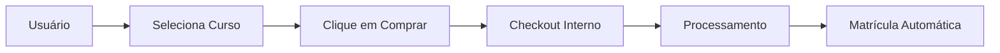
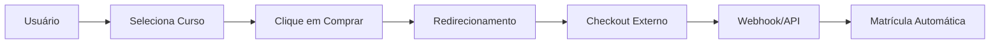

# Seleção de Gateway de Pagamento - Spark Course Community

## 🎯 **Visão Geral**

A funcionalidade de **Seleção de Gateway de Pagamento** permite que instrutores escolham como seus cursos serão vendidos, oferecendo flexibilidade total entre gateways internos e externos.

## 🏗️ **Gateways Suportados**

### **Gateways Internos** (Processamento na plataforma)
- **🛒 Mercado Pago** - PIX, Boleto, Cartão de Crédito
- **💳 Stripe** - Cartão de Crédito, PIX, Boleto

### **Gateways Externos** (Redirecionamento)
- **🔥 Hotmart** - Checkout externo
- **🥝 Kiwify** - Checkout externo

## 📋 **Como Funciona**

### **1. Criação/Edição de Curso**

Ao criar ou editar um curso pago, o instrutor pode:

1. **Ativar "Curso Pago"**
2. **Selecionar o Gateway**:
   - **Mercado Pago** (padrão) - Processamento interno
   - **Stripe** - Processamento interno
   - **Hotmart** - Redirecionamento externo
   - **Kiwify** - Redirecionamento externo

3. **Configurar URL Externa** (apenas para Hotmart/Kiwify):
   - URL completa do checkout do produto

### **2. Interface do Usuário**

```typescript
// Campos adicionados ao formulário
interface CourseForm {
  // ... campos existentes
  payment_gateway: 'mercadopago' | 'stripe' | 'hotmart' | 'kiwify';
  external_checkout_url?: string;
}
```

### **3. Validações**

- **Cursos pagos**: Preço > 0 obrigatório
- **Gateways externos**: URL de checkout obrigatória
- **Gateways internos**: URL externa ignorada

## 🔧 **Implementação Técnica**

### **Frontend (React/TypeScript)**

#### **Modal de Criação/Edição**
```tsx
// src/components/Admin/CreateCourseModal.tsx

// Schema de validação
const courseSchema = z.object({
  // ... campos existentes
  payment_gateway: z.enum(['mercadopago', 'stripe', 'hotmart', 'kiwify']).optional(),
  external_checkout_url: z.string().url().optional().or(z.literal('')),
});

// Interface condicional
{isPaid && (
  <div className="space-y-4">
    {/* Seleção de Gateway */}
    <Select value={selectedGateway} onValueChange={handleGatewayChange}>
      <SelectItem value="mercadopago">🛒 Mercado Pago</SelectItem>
      <SelectItem value="stripe">💳 Stripe</SelectItem>
      <SelectItem value="hotmart">🔥 Hotmart</SelectItem>
      <SelectItem value="kiwify">🥝 Kiwify</SelectItem>
    </Select>
    
    {/* URL Externa (condicional) */}
    {(selectedGateway === 'hotmart' || selectedGateway === 'kiwify') && (
      <Input 
        placeholder="URL do checkout externo"
        {...form.register("external_checkout_url")}
      />
    )}
  </div>
)}
```

### **Backend (Node.js/PostgreSQL)**

#### **Rotas Atualizadas**
```javascript
// backend/routes/courses.js

// Criação de curso
router.post('/', authenticateToken, async (req, res) => {
  const { 
    // ... campos existentes
    payment_gateway = 'mercadopago',
    external_checkout_url = null
  } = req.body;
  
  // Validação
  if ((payment_gateway === 'hotmart' || payment_gateway === 'kiwify') && !external_checkout_url) {
    return res.status(400).json({ error: 'URL externa obrigatória para gateways externos' });
  }
  
  // Inserção no banco
  await pool.query(
    `INSERT INTO courses (..., payment_gateway, external_checkout_url, ...)
     VALUES (..., $10, $11, ...)`,
    [..., payment_gateway, external_checkout_url, ...]
  );
});

// Busca de curso (inclui campos de gateway)
router.get('/:id', authenticateToken, async (req, res) => {
  const response = {
    ...course,
    payment_gateway: course.payment_gateway || 'mercadopago',
    external_checkout_url: course.external_checkout_url
  };
});
```

#### **Banco de Dados**
```sql
-- Migration: 20250707193000-add-payment-gateway-to-courses.sql
ALTER TABLE public.courses
  ADD COLUMN IF NOT EXISTS payment_gateway TEXT DEFAULT 'mercadopago',
  ADD COLUMN IF NOT EXISTS external_checkout_url TEXT;

COMMENT ON COLUMN public.courses.payment_gateway IS 'Gateway de pagamento do curso';
COMMENT ON COLUMN public.courses.external_checkout_url IS 'URL do checkout externo';
```

## 🧪 **Testes**

### **Script de Teste Automatizado**
```bash
# Executar testes
node scripts/test-gateway-config.js

# Configurar token para testes
export TEST_TOKEN="seu_token_aqui"
```

### **Testes Incluídos**
- ✅ Criação de curso com gateway
- ✅ Busca de curso com campos de gateway
- ✅ Edição de gateway
- ✅ Listagem com campos de gateway
- ✅ Validações de campos obrigatórios

## 📊 **Fluxo de Pagamento**

### **Gateways Internos**


### **Gateways Externos**


## 🔄 **Integração com API Externa**

Para gateways externos, o sistema utiliza a **API Externa de Matrícula**:

```bash
# Exemplo de matrícula via webhook
curl -X POST https://SEU_DOMINIO/api/external/enroll \
  -H "Authorization: Bearer SEU_TOKEN" \
  -H "Content-Type: application/json" \
  -d '{
    "user": {"cpf": "12345678900", "email": "aluno@email.com"},
    "course_id": "uuid-do-curso",
    "action": "enroll"
  }'
```

## 🎨 **Interface do Usuário**

### **Estados da Interface**
1. **Curso Gratuito**: Campos de gateway ocultos
2. **Curso Pago + Gateway Interno**: Apenas seleção de gateway
3. **Curso Pago + Gateway Externo**: Seleção + URL obrigatória

### **Validações Visuais**
- ✅ Ícones para cada gateway
- ✅ Descrições dos métodos de pagamento
- ✅ Placeholders específicos para URLs
- ✅ Mensagens de erro contextuais

## 🚀 **Próximos Passos**

### **Melhorias Planejadas**
- [ ] Suporte a mais gateways externos
- [ ] Configuração de comissões por gateway
- [ ] Relatórios de vendas por gateway
- [ ] Integração automática com webhooks
- [ ] Templates de checkout personalizados

### **Configurações Avançadas**
- [ ] Configuração de moedas por gateway
- [ ] Regras de desconto por gateway
- [ ] Configuração de impostos
- [ ] Integração com CRMs

---

**Esta funcionalidade oferece máxima flexibilidade para instrutores, permitindo escolher a melhor estratégia de monetização para cada curso.** 